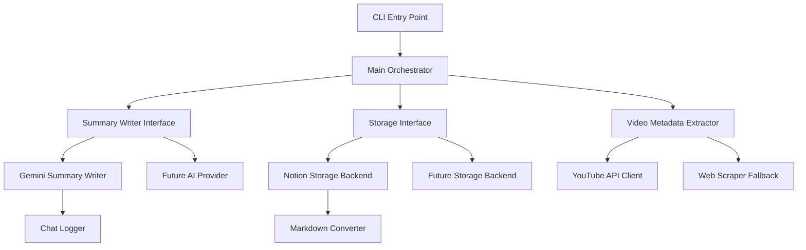

# Design Document

## Overview

This design restructures the YouTube-to-Notion integration codebase to improve modularity, testability, and maintainability. The current implementation has grown organically with functionality concentrated in large files and classes, making it difficult to understand, test, and extend.

The restructuring introduces clear component boundaries with single responsibilities, pluggable abstractions for summary generation and storage, and separate test suites for unit and integration testing. The design maintains full backward compatibility while enabling future extensibility.

## Architecture

### High-Level Component Flow



### Component Separation Strategy

The restructuring follows these principles:

1. **Single Responsibility**: Each component has one clear purpose
2. **Interface Segregation**: Components depend on abstractions, not concrete implementations
3. **Dependency Inversion**: High-level modules don't depend on low-level modules
4. **Open/Closed**: Components are open for extension but closed for modification

## Components and Interfaces

### Core Abstractions

#### SummaryWriter Interface

```python
from abc import ABC, abstractmethod
from typing import Dict, Any, Optional

class SummaryWriter(ABC):
    """Abstract interface for generating video summaries."""
    
    @abstractmethod
    def generate_summary(self, video_url: str, video_metadata: Dict[str, Any], 
                        custom_prompt: Optional[str] = None) -> str:
        """
        Generate a markdown summary for the video.
        
        Args:
            video_url: YouTube URL to process
            video_metadata: Video metadata (title, channel, etc.)
            custom_prompt: Optional custom prompt for generation
            
        Returns:
            str: Markdown summary with timestamps
        """
        pass
    
    @abstractmethod
    def validate_configuration(self) -> bool:
        """Validate that the summary writer is properly configured."""
        pass
```

#### Storage Interface

```python
from abc import ABC, abstractmethod
from typing import Dict, Any

class Storage(ABC):
    """Abstract interface for storing processed video content."""
    
    @abstractmethod
    def store_video_summary(self, video_data: Dict[str, Any]) -> bool:
        """
        Store processed video data.
        
        Args:
            video_data: Processed video data with title, summary, etc.
            
        Returns:
            bool: True if successful, False otherwise
        """
        pass
    
    @abstractmethod
    def validate_configuration(self) -> bool:
        """Validate that the storage backend is properly configured."""
        pass
    
    @abstractmethod
    def find_target_location(self) -> Optional[str]:
        """Find and return the target storage location identifier."""
        pass
```

### Component Implementations

#### Video Metadata Extractor

```python
class VideoMetadataExtractor:
    """Extracts metadata from YouTube videos using API or web scraping."""
    
    def __init__(self, youtube_api_key: Optional[str] = None):
        self.youtube_api_key = youtube_api_key
    
    def extract_metadata(self, video_url: str) -> Dict[str, Any]:
        """Extract video metadata (title, channel, thumbnail, etc.)."""
        pass
    
    def validate_url(self, url: str) -> bool:
        """Validate YouTube URL format."""
        pass
    
    def extract_video_id(self, url: str) -> str:
        """Extract video ID from YouTube URL."""
        pass
```

#### Gemini Summary Writer

```python
class GeminiSummaryWriter(SummaryWriter):
    """Summary writer implementation using Google Gemini AI."""
    
    def __init__(self, api_key: str, config: Optional[GeminiConfig] = None):
        self.api_key = api_key
        self.config = config or GeminiConfig()
        self.chat_logger = ChatLogger()
    
    def generate_summary(self, video_url: str, video_metadata: Dict[str, Any], 
                        custom_prompt: Optional[str] = None) -> str:
        """Generate summary using Gemini API with conversation logging."""
        pass
    
    def validate_configuration(self) -> bool:
        """Validate Gemini API key and configuration."""
        pass
```

#### Notion Storage Backend

```python
class NotionStorage(Storage):
    """Storage backend implementation for Notion databases."""
    
    def __init__(self, notion_token: str, database_name: str, parent_page_name: str):
        self.notion_token = notion_token
        self.database_name = database_name
        self.parent_page_name = parent_page_name
        self.markdown_converter = MarkdownConverter()
    
    def store_video_summary(self, video_data: Dict[str, Any]) -> bool:
        """Store video data in Notion database with rich formatting."""
        pass
    
    def validate_configuration(self) -> bool:
        """Validate Notion token and database access."""
        pass
    
    def find_target_location(self) -> Optional[str]:
        """Find target Notion database ID."""
        pass
```

### Main Orchestrator

```python
class VideoProcessor:
    """Main orchestrator that coordinates all components."""
    
    def __init__(self, metadata_extractor: VideoMetadataExtractor,
                 summary_writer: SummaryWriter, storage: Storage):
        self.metadata_extractor = metadata_extractor
        self.summary_writer = summary_writer
        self.storage = storage
    
    def process_video(self, video_url: str, custom_prompt: Optional[str] = None) -> bool:
        """
        Process a video through the complete pipeline.
        
        1. Extract metadata
        2. Generate summary
        3. Store results
        """
        # Extract metadata
        metadata = self.metadata_extractor.extract_metadata(video_url)
        
        # Generate summary
        summary = self.summary_writer.generate_summary(video_url, metadata, custom_prompt)
        
        # Prepare data for storage
        video_data = {
            "Title": metadata["title"],
            "Channel": metadata["channel"],
            "Video URL": video_url,
            "Cover": metadata["thumbnail_url"],
            "Summary": summary
        }
        
        # Store results
        return self.storage.store_video_summary(video_data)
    
    def validate_configuration(self) -> bool:
        """Validate all component configurations."""
        return (self.metadata_extractor.validate_configuration() and
                self.summary_writer.validate_configuration() and
                self.storage.validate_configuration())
```

## Data Models

### Configuration Models

```python
@dataclass
class GeminiConfig:
    model: str = "gemini-2.0-flash-exp"
    temperature: float = 0.7
    max_output_tokens: int = 8192
    default_prompt: str = DEFAULT_SUMMARY_PROMPT
    max_retries: int = 3
    timeout_seconds: int = 120

@dataclass
class NotionConfig:
    notion_token: str
    database_name: str = "YT Summaries"
    parent_page_name: str = "YouTube Summaries"

@dataclass
class ApplicationConfig:
    gemini_config: GeminiConfig
    notion_config: NotionConfig
    youtube_api_key: Optional[str] = None
```

### Video Data Model

```python
@dataclass
class VideoMetadata:
    video_id: str
    title: str
    channel: str
    description: str
    published_at: str
    thumbnail_url: str
    
@dataclass
class ProcessedVideo:
    metadata: VideoMetadata
    summary: str
    video_url: str
```

## Error Handling

### Exception Hierarchy

```python
class VideoProcessingError(Exception):
    """Base exception for video processing errors."""
    pass

class ConfigurationError(VideoProcessingError):
    """Configuration validation errors."""
    pass

class MetadataExtractionError(VideoProcessingError):
    """Metadata extraction errors."""
    pass

class SummaryGenerationError(VideoProcessingError):
    """Summary generation errors."""
    pass

class StorageError(VideoProcessingError):
    """Storage operation errors."""
    pass
```

### Error Handling Strategy

1. **Component Isolation**: Errors in one component don't affect others
2. **Graceful Degradation**: Fallback mechanisms where possible
3. **Clear Error Messages**: User-friendly error reporting with troubleshooting guidance
4. **Retry Logic**: Automatic retry for transient failures
5. **Logging**: Comprehensive error logging for debugging

## Testing Strategy

### Unit Test Structure

```
tests/
├── unit/                           # Fast, isolated unit tests
│   ├── test_video_metadata_extractor.py
│   ├── test_gemini_summary_writer.py
│   ├── test_notion_storage.py
│   ├── test_video_processor.py
│   └── test_markdown_converter.py
├── integration/                    # Integration tests with external services
│   ├── test_end_to_end_flow.py
│   ├── test_notion_integration.py
│   └── test_gemini_integration.py
└── fixtures/                       # Test data and mocks
    ├── mock_implementations.py
    └── test_data.py
```

### Mock Implementations

```python
class MockSummaryWriter(SummaryWriter):
    """In-memory mock for testing."""
    
    def __init__(self, responses: Dict[str, str]):
        self.responses = responses
        self.calls = []
    
    def generate_summary(self, video_url: str, video_metadata: Dict[str, Any], 
                        custom_prompt: Optional[str] = None) -> str:
        self.calls.append((video_url, video_metadata, custom_prompt))
        return self.responses.get(video_url, "Mock summary")
    
    def validate_configuration(self) -> bool:
        return True

class MockStorage(Storage):
    """In-memory mock for testing."""
    
    def __init__(self):
        self.stored_videos = []
        self.should_fail = False
    
    def store_video_summary(self, video_data: Dict[str, Any]) -> bool:
        if self.should_fail:
            return False
        self.stored_videos.append(video_data)
        return True
    
    def validate_configuration(self) -> bool:
        return not self.should_fail
    
    def find_target_location(self) -> Optional[str]:
        return "mock-location-id" if not self.should_fail else None
```

### Test Categories

#### Unit Tests (< 10 seconds total)
- Component behavior in isolation
- Mock all external dependencies
- No I/O operations
- No log file creation
- Focus on business logic and edge cases

#### Integration Tests
- Component interactions
- Real external service calls (with test data)
- Use separate test Notion database "YT Summaries [TEST]"
- Load configuration from `.env-test` file, never from `.env`
- Validate end-to-end workflows
- Test error scenarios with real APIs

## Migration Strategy

### Phase 1: Extract Components
1. Create abstract interfaces (SummaryWriter, Storage)
2. Extract VideoMetadataExtractor from YouTubeProcessor
3. Create GeminiSummaryWriter implementation
4. Create NotionStorage implementation
5. Maintain backward compatibility with existing code

### Phase 2: Introduce Main Orchestrator
1. Create VideoProcessor orchestrator
2. Update main.py to use new orchestrator
3. Maintain existing CLI interface
4. All existing tests should pass

### Phase 3: Separate Test Suites
1. Create unit test directory structure
2. Implement mock implementations
3. Migrate existing tests to appropriate categories
4. Create new unit tests for components
5. Set up separate integration test database

### Phase 4: Clean Up and Optimize
1. Remove deprecated code paths
2. Optimize component interactions
3. Add comprehensive error handling
4. Performance optimizations

## Directory Structure

### New Package Structure

```
src/youtube_notion/
├── __init__.py
├── main.py                         # Updated orchestrator
├── interfaces/                     # Abstract interfaces
│   ├── __init__.py
│   ├── summary_writer.py
│   └── storage.py
├── extractors/                     # Metadata extraction
│   ├── __init__.py
│   ├── video_metadata_extractor.py
│   └── youtube_client.py
├── writers/                        # Summary generation
│   ├── __init__.py
│   ├── gemini_summary_writer.py
│   └── base_summary_writer.py
├── storage/                        # Storage backends
│   ├── __init__.py
│   ├── notion_storage.py
│   └── base_storage.py
├── processors/                     # Main orchestration
│   ├── __init__.py
│   └── video_processor.py
├── utils/                          # Utilities
│   ├── __init__.py
│   ├── markdown_converter.py
│   ├── chat_logger.py
│   └── exceptions.py
└── config/                         # Configuration
    ├── __init__.py
    ├── settings.py
    └── example_data.py
```

### Backward Compatibility

The restructuring maintains backward compatibility by:

1. **Preserving CLI Interface**: All existing command-line arguments work unchanged
2. **Maintaining API Contracts**: Existing function signatures remain the same
3. **Configuration Compatibility**: Environment variables and configuration remain unchanged
4. **Output Format**: Results maintain the same structure and format
5. **Error Messages**: User-facing error messages remain consistent

## Configuration Management

### Environment Variables

#### Production Configuration (`.env`)
```bash
# Required for YouTube mode
NOTION_TOKEN=your_notion_token
GEMINI_API_KEY=your_gemini_api_key

# Optional
YOUTUBE_API_KEY=your_youtube_api_key

# Configuration
NOTION_DATABASE_NAME="YT Summaries"
NOTION_PARENT_PAGE_NAME="YouTube Summaries"
GEMINI_MODEL="gemini-2.0-flash-exp"
GEMINI_TEMPERATURE=0.7
GEMINI_MAX_OUTPUT_TOKENS=8192
```

#### Test Configuration (`.env-test`)
```bash
# Test environment configuration
NOTION_TOKEN=your_test_notion_token
GEMINI_API_KEY=your_test_gemini_api_key
YOUTUBE_API_KEY=your_test_youtube_api_key

# Test-specific settings
NOTION_DATABASE_NAME="YT Summaries [TEST]"
NOTION_PARENT_PAGE_NAME="YouTube Summaries [TEST]"
GEMINI_MODEL="gemini-2.0-flash-exp"
GEMINI_TEMPERATURE=0.7
GEMINI_MAX_OUTPUT_TOKENS=8192
```

### Factory Pattern for Component Creation

```python
class ComponentFactory:
    """Factory for creating configured components."""
    
    @staticmethod
    def create_summary_writer(config: ApplicationConfig) -> SummaryWriter:
        """Create configured summary writer."""
        return GeminiSummaryWriter(
            api_key=config.gemini_config.api_key,
            config=config.gemini_config
        )
    
    @staticmethod
    def create_storage(config: ApplicationConfig) -> Storage:
        """Create configured storage backend."""
        return NotionStorage(
            notion_token=config.notion_config.notion_token,
            database_name=config.notion_config.database_name,
            parent_page_name=config.notion_config.parent_page_name
        )
    
    @staticmethod
    def create_metadata_extractor(config: ApplicationConfig) -> VideoMetadataExtractor:
        """Create configured metadata extractor."""
        return VideoMetadataExtractor(
            youtube_api_key=config.youtube_api_key
        )
```

This design provides a solid foundation for the architectural restructuring while maintaining full operational compatibility and enabling future extensibility.