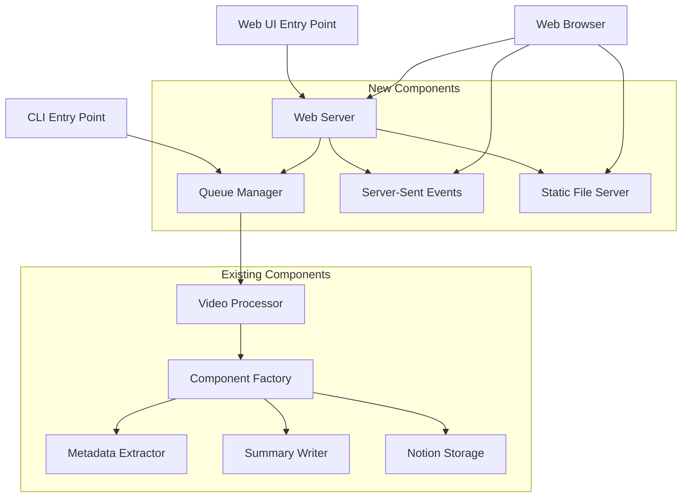
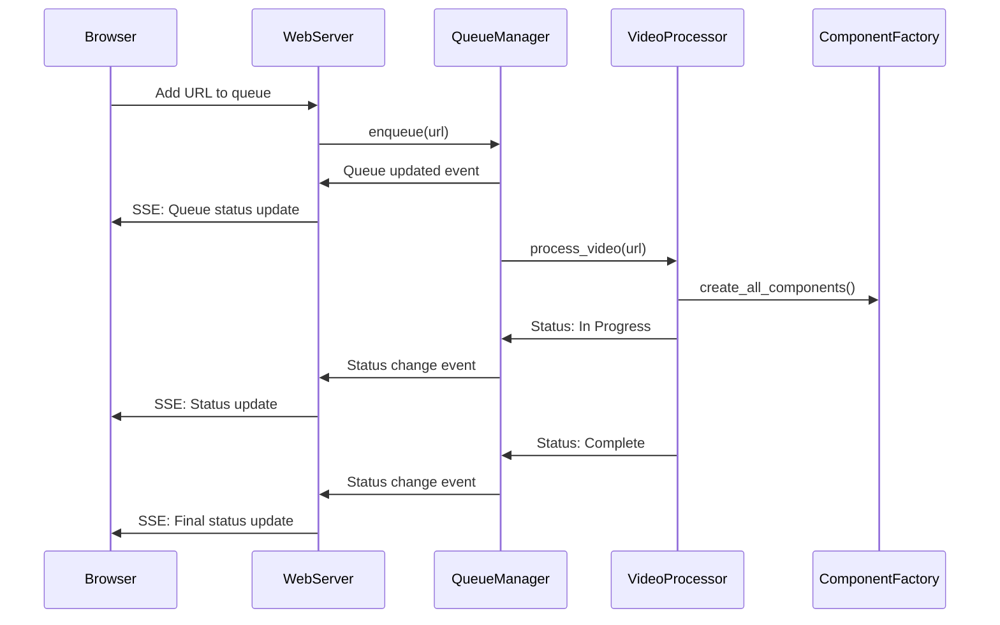

# Design Document

## Overview

The web UI mode feature adds a browser-based interface to the YouTube-to-Notion integration application. The design follows a client-server architecture where the existing CLI application is extended with a web server backend that serves a single-page application (SPA) frontend. The system maintains the existing component-based architecture while adding new web-specific components for queue management, real-time communication, and UI serving.

The design prioritizes code reuse by implementing a shared queue system that both CLI batch processing and web UI modes can utilize. This ensures consistency between processing modes while avoiding code duplication.

## Architecture

### High-Level Architecture



### Component Interaction Flow



## Components and Interfaces

### New Components

#### 1. QueueManager (`processors/queue_manager.py`)

**Purpose**: Centralized queue management for both CLI and web UI modes

**Interface**:
```python
class QueueManager:
    def enqueue(self, url: str, custom_prompt: Optional[str] = None) -> str
    def get_queue_status(self) -> Dict[str, List[QueueItem]]
    def get_item_status(self, item_id: str) -> QueueItem
    def start_processing(self) -> None
    def stop_processing(self) -> None
    def add_status_listener(self, callback: Callable) -> None
    def remove_status_listener(self, callback: Callable) -> None
```

**Key Features**:
- Thread-safe queue operations using `threading.Lock`
- Observable pattern for status change notifications
- Automatic processing loop in background thread
- Support for custom prompts per URL
- Unique item IDs for tracking
- Graceful shutdown handling

#### 2. WebServer (`web/server.py`)

**Purpose**: HTTP server for serving UI and handling API requests

**Interface**:
```python
from fastapi import FastAPI, HTTPException
from pydantic import BaseModel

class WebServer:
    def __init__(self, queue_manager: QueueManager, port: int = 8080)
    def start(self) -> None
    def stop(self) -> None

# FastAPI endpoints with automatic validation
@app.post("/api/queue", response_model=AddUrlResponse)
async def add_url_endpoint(request: AddUrlRequest) -> AddUrlResponse

@app.get("/api/status", response_model=QueueStatusResponse)
async def get_status_endpoint() -> QueueStatusResponse

@app.get("/api/chat-log/{item_id}")
async def get_chat_log_endpoint(item_id: str) -> dict

@app.get("/events")
async def sse_endpoint() -> StreamingResponse
```

**Technology**: FastAPI web framework (modern, high-performance, async)
**Key Features**:
- RESTful API endpoints with automatic OpenAPI documentation
- Server-Sent Events (SSE) for real-time updates with async support
- Static file serving for frontend assets
- Built-in CORS middleware
- Automatic request/response validation with Pydantic
- Type hints and dependency injection

#### 3. QueueItem (`web/models.py`)

**Purpose**: Data model for queue items with status tracking

**Interface**:
```python
@dataclass
class QueueItem:
    id: str
    url: str
    custom_prompt: Optional[str]
    status: QueueStatus
    title: Optional[str]
    thumbnail_url: Optional[str]
    channel: Optional[str]
    created_at: datetime
    started_at: Optional[datetime]
    completed_at: Optional[datetime]
    error_message: Optional[str]
    chat_log_path: Optional[str]
    chunk_logs: List[str]
    current_phase: Optional[str]
    current_chunk: Optional[int]
    total_chunks: Optional[int]
```

#### 4. Frontend SPA (`web/static/`)

**Purpose**: Single-page application for the web interface

**Technology**: Vanilla JavaScript with modern ES6+ features
**Key Files**:
- `index.html` - Main HTML structure
- `app.js` - Main application logic
- `styles.css` - YouTube-inspired styling
- `components/` - Reusable UI components

### Modified Components

#### 1. CLI Entry Point (`youtube_notion_cli.py`)

**Changes**:
- Add `--ui` flag to argument parser
- Initialize QueueManager for batch processing
- Delegate to WebServer when UI mode is requested

#### 2. Main Application (`src/youtube_notion/main.py`)

**Changes**:
- Add `main_ui()` function for web UI mode
- Integrate QueueManager for batch processing
- Maintain backward compatibility

## Data Models

### Queue Status Enumeration

```python
class QueueStatus(Enum):
    TODO = "todo"
    IN_PROGRESS = "in_progress"
    COMPLETED = "completed"
    FAILED = "failed"
```

### Processing Phase Enumeration

```python
class ProcessingPhase(Enum):
    METADATA_EXTRACTION = "Extracting metadata"
    SUMMARY_GENERATION = "Generating summary"
    CHUNK_PROCESSING = "Processing chunk"
    NOTION_UPLOAD = "Uploading to Notion"
```

### API Request/Response Models (Pydantic)

```python
from pydantic import BaseModel, HttpUrl
from typing import List, Optional

class AddUrlRequest(BaseModel):
    url: HttpUrl
    custom_prompt: Optional[str] = None

class AddUrlResponse(BaseModel):
    success: bool
    item_id: Optional[str] = None
    error: Optional[str] = None

class QueueStatusResponse(BaseModel):
    todo: List[QueueItem]
    in_progress: List[QueueItem]
    completed: List[QueueItem]
    failed: List[QueueItem]

class QueueItem(BaseModel):
    id: str
    url: str
    custom_prompt: Optional[str]
    status: QueueStatus
    title: Optional[str]
    thumbnail_url: Optional[str]
    channel: Optional[str]
    created_at: datetime
    started_at: Optional[datetime]
    completed_at: Optional[datetime]
    error_message: Optional[str]
    chat_log_path: Optional[str]
    chunk_logs: List[str]
    current_phase: Optional[str]
    current_chunk: Optional[int]
    total_chunks: Optional[int]
```

## Error Handling

### Error Categories

1. **Validation Errors**: Invalid URLs, missing parameters
2. **Processing Errors**: Video processing failures, API errors
3. **Server Errors**: Web server issues, connection problems
4. **Queue Errors**: Queue operation failures, concurrency issues

### Error Handling Strategy

```python
# Web API error responses
@dataclass
class ErrorResponse:
    error: str
    details: Optional[str]
    error_code: str
    timestamp: datetime

# Error codes
class ErrorCodes:
    INVALID_URL = "INVALID_URL"
    PROCESSING_FAILED = "PROCESSING_FAILED"
    QUEUE_FULL = "QUEUE_FULL"
    SERVER_ERROR = "SERVER_ERROR"
```

### Error Recovery

- **Queue Processing**: Continue processing remaining items on individual failures
- **Web Server**: Graceful error responses with appropriate HTTP status codes
- **Real-time Updates**: Reconnection logic for SSE connections
- **Frontend**: User-friendly error messages with retry options

## Testing Strategy

### Unit Testing Approach

#### QueueManager Testing
```python
class TestQueueManager:
    def test_enqueue_valid_url(self, mock_video_processor)
    def test_queue_status_updates(self, mock_video_processor)
    def test_concurrent_operations(self, mock_video_processor)
    def test_status_listeners(self, mock_video_processor)
    def test_graceful_shutdown(self, mock_video_processor)
```

#### WebServer Testing (FastAPI)
```python
from fastapi.testclient import TestClient
import pytest

class TestWebServer:
    @pytest.fixture
    def client(self, mock_queue_manager):
        app = create_app(mock_queue_manager)
        return TestClient(app)
    
    def test_add_url_endpoint(self, client, mock_queue_manager)
    def test_get_status_endpoint(self, client, mock_queue_manager)
    async def test_sse_endpoint(self, client, mock_queue_manager)
    def test_static_file_serving(self, client)
    def test_automatic_validation(self, client)
    def test_openapi_docs(self, client)
```

#### Frontend Testing
- **Unit Tests**: JavaScript functions using Jest or similar
- **Integration Tests**: Selenium WebDriver for UI interactions
- **Mock Server**: Test frontend against mock API responses

### Mock Implementations

```python
# tests/fixtures/mock_implementations.py
class MockQueueManager:
    def __init__(self):
        self.items = {}
        self.listeners = []
    
    def enqueue(self, url: str, custom_prompt: Optional[str] = None) -> str:
        # Mock implementation
        pass

class MockWebServer:
    def __init__(self, queue_manager):
        self.queue_manager = queue_manager
        self.running = False
    
    def start(self):
        self.running = True
```

### Test Data

```python
# tests/fixtures/web_test_data.py
SAMPLE_QUEUE_ITEMS = [
    QueueItem(
        id="test-1",
        url="https://youtu.be/test123",
        status=QueueStatus.TODO,
        created_at=datetime.now()
    ),
    # Additional test items...
]

SAMPLE_SSE_EVENTS = [
    {"type": "queue_update", "data": {...}},
    {"type": "status_change", "data": {...}},
    # Additional events...
]
```

## Implementation Details

### Web Server Configuration

```python
# web/config.py
from pydantic import BaseModel

class WebServerConfig(BaseModel):
    host: str = "127.0.0.1"
    port: int = 8080
    debug: bool = False
    static_folder: str = "web/static"
    max_queue_size: int = 100
    sse_heartbeat_interval: int = 30
    reload: bool = False  # For uvicorn auto-reload in development
    
    class Config:
        env_prefix = "WEB_"  # Allow WEB_HOST, WEB_PORT, etc.
```

### Real-time Communication

**Server-Sent Events Implementation**:
```python
from fastapi import FastAPI
from fastapi.responses import StreamingResponse
import asyncio

@app.get("/events")
async def sse_endpoint():
    async def event_stream():
        while True:
            # Wait for queue events asynchronously
            event = await queue_manager.get_next_event_async()
            yield f"data: {json.dumps(event)}\n\n"
            await asyncio.sleep(0.1)  # Prevent busy waiting
    
    return StreamingResponse(
        event_stream(),
        media_type='text/event-stream',
        headers={
            'Cache-Control': 'no-cache',
            'Connection': 'keep-alive'
        }
    )
```

### Frontend Architecture

**Component Structure**:
```javascript
// app.js
class YouTubeNotionApp {
    constructor() {
        this.queueColumns = new QueueColumns();
        this.urlInput = new UrlInput();
        this.chatLogModal = new ChatLogModal();
        this.sseConnection = new SSEConnection();
    }
}

class QueueColumns {
    render(queueData) {
        // Render three columns with items
    }
    
    moveItem(itemId, fromStatus, toStatus) {
        // Animate item movement between columns
    }
}
```

### YouTube-like Styling

**CSS Design System**:
```css
:root {
    --yt-red: #ff0000;
    --yt-dark-bg: #0f0f0f;
    --yt-light-bg: #ffffff;
    --yt-text: #030303;
    --yt-secondary-text: #606060;
    --yt-border: #e5e5e5;
}

.queue-column {
    background: var(--yt-light-bg);
    border: 1px solid var(--yt-border);
    border-radius: 8px;
    /* YouTube-inspired styling */
}
```

### Dependency Integration

**New Dependencies**:
```txt
# requirements.txt additions
fastapi>=0.104.0
uvicorn>=0.24.0
pydantic>=2.0.0
```

**Development Dependencies**:
```txt
# requirements-dev.txt additions
selenium>=4.0.0
httpx>=0.25.0  # For testing FastAPI
pytest-asyncio>=0.21.0
```

## Security Considerations

### Input Validation
- URL format validation using regex patterns
- XSS prevention through proper HTML escaping
- CSRF protection for state-changing operations

### Network Security
- CORS configuration for development vs production
- Rate limiting for API endpoints
- Input sanitization for all user inputs

### Data Privacy
- No sensitive data in client-side JavaScript
- Secure handling of API keys (server-side only)
- Chat log access control

## Performance Considerations

### Queue Management
- Efficient data structures for queue operations
- Background processing to avoid blocking UI
- Memory management for large queues

### Real-time Updates
- SSE connection pooling and management
- Efficient event serialization
- Client-side debouncing for rapid updates

### Frontend Optimization
- Lazy loading for chat logs
- Virtual scrolling for large queues
- Efficient DOM updates using modern JavaScript

## Deployment Considerations

### Development Mode
- Hot reloading for frontend assets
- Debug logging enabled
- CORS allowing all origins

### Production Mode
- Minified and bundled frontend assets
- Production logging configuration
- Restricted CORS origins
- Process management (systemd, Docker, etc.)

This design ensures a robust, testable, and maintainable web UI that integrates seamlessly with the existing YouTube-to-Notion processing pipeline while following established architectural patterns and testing standards.