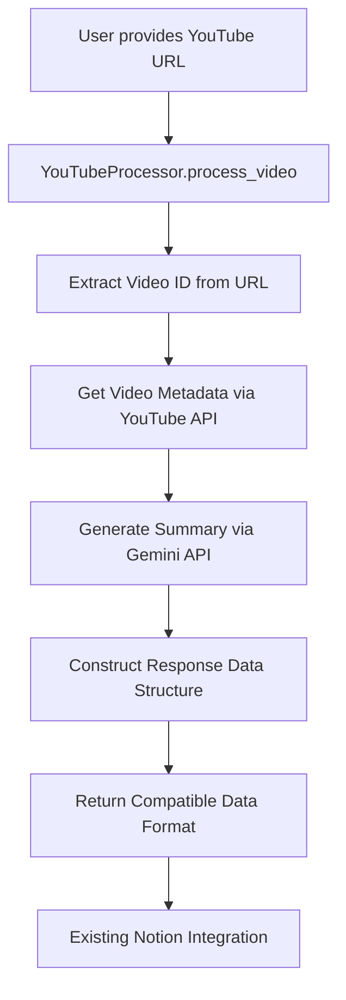

# Design Document

## Overview

This design extends the existing YouTube-Notion integration by adding dynamic YouTube video processing capabilities using Google Gemini AI. The system will replace the static `EXAMPLE_DATA` with a new `YouTubeProcessor` class that can extract video metadata, generate AI-powered summaries, and return data in the same format as the existing example data structure.

The design maintains backward compatibility with the existing Notion integration while adding new functionality for real-time YouTube video processing.

## Architecture

### High-Level Flow



### Component Integration

The new YouTube processing functionality will integrate with the existing architecture as follows:

- **New Component**: `YouTubeProcessor` class in `src/youtube_notion/processors/youtube_processor.py`
- **Enhanced CLI**: Modified `youtube_notion_cli.py` to accept YouTube URLs as command-line arguments
- **Updated Main**: Modified `main.py` to support both example data mode and YouTube processing mode
- **Configuration**: New environment variables for Google Gemini API key and YouTube Data API key

## Components and Interfaces

### YouTubeProcessor Class

```python
class YouTubeProcessor:
    """Processes YouTube videos to generate structured data for Notion integration."""
    
    def __init__(self, gemini_api_key: str, youtube_api_key: str = None):
        """Initialize with required API keys."""
        
    def process_video(self, youtube_url: str, custom_prompt: str = None) -> dict:
        """
        Process a YouTube video and return structured data.
        
        Args:
            youtube_url: Valid YouTube URL
            custom_prompt: Optional custom prompt for Gemini (uses default if None)
            
        Returns:
            dict: Data structure compatible with EXAMPLE_DATA format
            
        Raises:
            InvalidURLError: If YouTube URL is invalid
            APIError: If API calls fail
            ProcessingError: If video processing fails
        """
        
    def _extract_video_id(self, url: str) -> str:
        """Extract video ID from YouTube URL."""
        
    def _get_video_metadata(self, video_id: str) -> dict:
        """Get video title, channel, and thumbnail from YouTube."""
        
    def _generate_summary(self, video_url: str, prompt: str) -> str:
        """Generate AI summary using Google Gemini."""
        
    def _construct_thumbnail_url(self, video_id: str) -> str:
        """Construct YouTube thumbnail URL."""
```

### URL Validation and Video ID Extraction

The system will support multiple YouTube URL formats:
- `https://www.youtube.com/watch?v=VIDEO_ID`
- `https://youtu.be/VIDEO_ID`
- `https://www.youtube.com/watch?v=VIDEO_ID&t=123s` (with timestamp)

### Video Metadata Extraction

Two approaches for getting video metadata:

**Option 1: YouTube Data API v3 (Recommended)**
- Requires API key but provides reliable, structured data
- Returns title, channel name, description, thumbnail URLs
- Has quota limits but sufficient for typical usage

**Option 2: Web Scraping Fallback**
- No API key required
- Less reliable, may break with YouTube changes
- Used as fallback if YouTube API is not configured

### Gemini Integration

The Gemini integration will use the provided code pattern with these enhancements:

```python
def _generate_summary(self, video_url: str, prompt: str) -> str:
    """Generate summary using Google Gemini API."""
    client = genai.Client(api_key=self.gemini_api_key)
    model = "gemini-2.5-pro"
    
    contents = [
        types.Content(
            role="user",
            parts=[
                types.Part(
                    file_data=types.FileData(
                        file_uri=video_url,
                        mime_type="video/*"
                    )
                ),
                types.Part.from_text(text=prompt)
            ]
        )
    ]
    
    # Stream response and collect full text
    full_response = ""
    for chunk in client.models.generate_content_stream(
        model=model,
        contents=contents,
        config=generate_content_config
    ):
        full_response += chunk.text
    
    return full_response
```

## Data Models

### Input Data Model

```python
@dataclass
class YouTubeProcessingRequest:
    url: str
    custom_prompt: Optional[str] = None
    
    def __post_init__(self):
        if not self._is_valid_youtube_url(self.url):
            raise InvalidURLError(f"Invalid YouTube URL: {self.url}")
```

### Output Data Model

The output maintains compatibility with the existing `EXAMPLE_DATA` structure:

```python
{
    "Title": str,           # Video title from YouTube metadata
    "Channel": str,         # Channel name from YouTube metadata  
    "Video URL": str,       # Original YouTube URL
    "Cover": str,          # Thumbnail URL (maxresdefault.jpg)
    "Summary": str         # AI-generated markdown summary with timestamps
}
```

### Configuration Model

```python
@dataclass
class YouTubeProcessorConfig:
    gemini_api_key: str
    youtube_api_key: Optional[str] = None
    default_prompt: str = DEFAULT_SUMMARY_PROMPT
    max_retries: int = 3
    timeout_seconds: int = 120
```

## Error Handling

### Exception Hierarchy

```python
class YouTubeProcessingError(Exception):
    """Base exception for YouTube processing errors."""

class InvalidURLError(YouTubeProcessingError):
    """Raised when YouTube URL is invalid or unsupported."""

class APIError(YouTubeProcessingError):
    """Raised when API calls fail."""
    
class VideoUnavailableError(YouTubeProcessingError):
    """Raised when video is private, deleted, or restricted."""
    
class QuotaExceededError(APIError):
    """Raised when API quota limits are exceeded."""
```

### Error Handling Strategy

1. **URL Validation**: Validate YouTube URLs before processing
2. **API Failures**: Implement retry logic with exponential backoff
3. **Quota Management**: Provide clear error messages for quota issues
4. **Graceful Degradation**: Fall back to web scraping if YouTube API fails
5. **User Feedback**: Provide actionable error messages

### Retry Logic

```python
def _api_call_with_retry(self, api_func, *args, **kwargs):
    """Execute API call with retry logic."""
    for attempt in range(self.config.max_retries):
        try:
            return api_func(*args, **kwargs)
        except (APIError, requests.RequestException) as e:
            if attempt == self.config.max_retries - 1:
                raise
            time.sleep(2 ** attempt)  # Exponential backoff
```

## Testing Strategy

### Unit Tests

1. **URL Parsing Tests**
   - Valid YouTube URL formats
   - Invalid URL handling
   - Edge cases (URLs with parameters, shortened URLs)

2. **Metadata Extraction Tests**
   - Mock YouTube API responses
   - Handle missing metadata gracefully
   - Test thumbnail URL construction

3. **Gemini Integration Tests**
   - Mock Gemini API responses
   - Test prompt formatting
   - Handle API errors and timeouts

4. **Data Structure Tests**
   - Verify output format compatibility
   - Test data validation and sanitization

### Integration Tests

1. **End-to-End Processing**
   - Process real YouTube videos (using test videos)
   - Verify complete data pipeline
   - Test with different video types (short, long, different channels)

2. **API Integration Tests**
   - Test with real APIs (using test API keys)
   - Verify error handling with actual API failures
   - Test quota limit scenarios

### Mock Strategy

- Mock external API calls for unit tests
- Use test doubles for YouTube and Gemini APIs
- Create fixtures with realistic API response data
- Test error scenarios with mocked failures

## Configuration Management

### Environment Variables

```bash
# Required
NOTION_TOKEN=your_notion_token
GEMINI_API_KEY=your_gemini_api_key

# Optional
YOUTUBE_API_KEY=your_youtube_api_key  # Falls back to web scraping if not provided

# Configuration
YOUTUBE_PROCESSOR_TIMEOUT=120
YOUTUBE_PROCESSOR_MAX_RETRIES=3
```

### Default Prompt Configuration

The system will include a configurable default prompt:

```python
DEFAULT_SUMMARY_PROMPT = """
Condense all the practical information and examples regarding the video content in form of an article. 
Don't miss any details but keep the article as short and direct as possible. 
Put timestamp(s) to fragments of the video next to each fact you got from the video.
Format the output in markdown with proper headers, bullet points, and formatting.
Use timestamps in the format [MM:SS] or [MM:SS-MM:SS] for time ranges.
"""
```

### CLI Integration

Enhanced command-line interface:

```bash
# Process specific YouTube video
python youtube_notion_cli.py --url "https://www.youtube.com/watch?v=VIDEO_ID"

# Use custom prompt
python youtube_notion_cli.py --url "https://www.youtube.com/watch?v=VIDEO_ID" --prompt "Custom prompt here"

# Use example data (backward compatibility)
python youtube_notion_cli.py --example-data
```

## Dependencies

### New Dependencies

Add to `requirements.txt`:
```
google-genai>=0.1.0
google-api-python-client>=2.0.0  # For YouTube Data API
requests>=2.25.0  # For web scraping fallback
```

### Dependency Management

- Pin major versions to ensure stability
- Use optional dependencies for YouTube API (graceful degradation)
- Maintain backward compatibility with existing dependencies