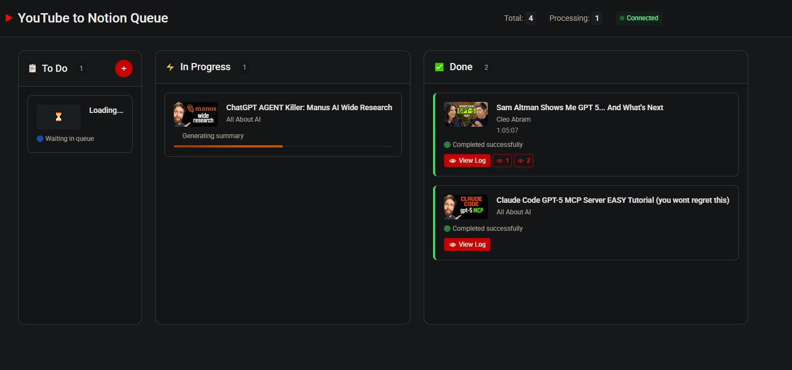

# YouTube to Notion Database Integration

A Python application that automatically processes YouTube videos and adds AI-generated summaries to a Notion database with proper markdown formatting and rich text conversion.

## Disclaimer

This project was fully created and is maintained by AI agents.

- **Main development**: Handled by [Kiro Dev](https://kiro.dev/) (Amazon), responsible for the core functionalities.
- **Support & maintenance**: Performed by [Jules](https://jules.google.com) (Google), focusing on minor changes, tweaks, and bug fixes.

The primary purpose of this project—despite being fully functional—is to explore and test the capabilities and limitations of AI agents.

All contents of this repository, including this README file, were generated by these AI agents.

## Features

- 🎥 **Dynamic YouTube Processing**: Process any YouTube video URL with AI-generated summaries
- 🤖 **Google Gemini Integration**: Uses Google Gemini AI to generate intelligent video summaries
- ⏱️ **Long Video Processing**: Automatically splits videos >45 minutes into overlapping chunks for comprehensive analysis
- 📺 **Embedded Videos**: Automatically embeds YouTube videos at the top of each page
- ⏰ **Smart Timestamps**: Converts timestamps like `[8:05]` or `[8:05-8:24]` to clickable YouTube links
- 📝 **Markdown to Notion**: Converts markdown summaries to Notion's rich text format
- 🎨 **Rich Formatting**: Supports headers, bullet points, numbered lists, bold, and italic text
- 🖼️ **Cover Images**: Automatically adds video thumbnails as page covers
- 🌐 **Web UI Mode**: Visual three-column interface (To Do, In Progress, Done) for queue management
- 🔄 **Dual Mode Operation**: Supports both CLI and web UI modes with shared processing logic
- 📊 **Real-time Updates**: Live status updates and progress monitoring through Server-Sent Events
- 🛡️ **Robust Error Handling**: Comprehensive error handling with retry logic and graceful fallbacks
- ⚡ **Intelligent Quota Management**: Automatically handles API quota limits with smart retry delays
- 🔄 **Batch Processing**: Process multiple URLs with resilient error handling
- 🧪 **Comprehensive Testing**: 716 unit tests, 26 integration tests, and 84 JavaScript tests ensuring reliable functionality
- 📁 **Component-Based Architecture**: Clean, maintainable codebase with dependency injection

## Architecture

This project follows a **component-based architecture** with clear separation of concerns:

- **Interfaces First**: All components implement abstract interfaces for testability
- **Dependency Injection**: Uses `ComponentFactory` for component creation and wiring
- **Single Responsibility**: Each component has one clear purpose
- **Comprehensive Testing**: Unit tests with mock implementations for fast feedback

## Project Structure

```
youtube-notion-integration/
├── src/
│   └── youtube_notion/          # Main package (use relative imports)
│       ├── __init__.py
│       ├── main.py              # Application entry point
│       ├── interfaces/          # Abstract base classes (contracts)
│       │   ├── storage.py       # Storage interface
│       │   └── summary_writer.py # Summary writer interface
│       ├── extractors/          # Video metadata extraction
│       │   └── video_metadata_extractor.py
│       ├── writers/             # AI summary generation
│       │   └── gemini_summary_writer.py
│       ├── storage/             # Data persistence
│       │   └── notion_storage.py
│       ├── processors/          # Orchestration layer
│       │   ├── video_processor.py # Main orchestrator
│       │   └── queue_manager.py   # Queue management for web UI
│       ├── config/              # Configuration & DI
│       │   ├── factory.py       # Component factory
│       │   ├── settings.py      # Environment config
│       │   └── example_data.py
│       ├── web/                 # Web UI components
│       │   ├── server.py        # FastAPI web server
│       │   ├── models.py        # Pydantic data models
│       │   └── config.py        # Web server configuration
│       └── utils/               # Shared utilities
│           ├── exceptions.py    # Exception hierarchy
│           ├── chat_logger.py   # Conversation logging
│           ├── video_utils.py   # Video processing utilities
│           └── markdown_converter.py
├── web/static/                  # Frontend assets (served by FastAPI)
│   ├── index.html               # Main HTML page
│   ├── style.css                # Application styles
│   ├── components/              # JavaScript components
│   │   ├── url-input.js         # URL input and validation
│   │   ├── queue-columns.js     # Three-column queue interface
│   │   └── sse-connection.js    # Server-Sent Events handling
│   └── tests/                   # JavaScript unit tests (84 tests, ~3s)
│       ├── url-input.test.js    # URL input component tests
│       ├── queue-columns.test.js # Queue interface tests
│       ├── sse-connection.test.js # SSE connection tests
│       └── error-handling.test.js # Error handling tests
├── tests/                       # Comprehensive test suite
│   ├── unit/                    # Fast, isolated tests (716 tests, ~24s)
│   ├── integration/             # End-to-end tests (26 tests, ~124s)
│   └── fixtures/                # Test data and mocks
├── youtube_notion_cli.py        # Command-line entry point
├── pyproject.toml              # Modern Python packaging
└── requirements.txt            # Dependencies
```

## Prerequisites

- Python 3.12+
- Notion account with API access
- A Notion database named "YT Summaries" in a page called "YouTube Knowledge Base"
- **Google Gemini API key** (required for YouTube processing mode)
- YouTube Data API key (optional, improves metadata extraction)

## Quick Start

### 5-Minute Setup Checklist

- [ ] **1. Clone and Install**
  ```bash
  git clone <repository-url>
  cd youtube-notion-integration
  pip install -e .
  ```

- [ ] **2. Get API Keys**
  - [ ] [Notion Integration Token](https://www.notion.so/my-integrations) (required)
  - [ ] [Google Gemini API Key](https://aistudio.google.com/app/apikey) (required for YouTube processing)
  - [ ] [YouTube Data API Key](https://console.cloud.google.com/) (optional but recommended)

- [ ] **3. Configure Environment**
  ```bash
  cp .env.example .env
  # Edit .env with your API keys
  ```

- [ ] **4. Set Up Notion Database**
  - [ ] Create database named "YT Summaries" 
  - [ ] Add required properties: Title, Video URL, Channel
  - [ ] Share database with your integration

- [ ] **5. Test Setup**
  ```bash
  # Test with example data first
  python youtube_notion_cli.py --example-data
  
  # Try the web UI mode (recommended)
  python youtube_notion_cli.py --ui
  
  # Then try a real YouTube video via CLI
  python youtube_notion_cli.py --url "https://youtu.be/dQw4w9WgXcQ"
  ```

### Detailed Setup Instructions

#### 1. Clone and Setup

```bash
git clone <repository-url>
cd youtube-notion-integration
pip install -e .
```

### 2. Configure Environment

```bash
# Copy environment template
cp .env.example .env

# Edit .env and add your API keys
NOTION_TOKEN=your_notion_integration_token_here
GEMINI_API_KEY=your_google_gemini_api_key_here

# Optional: Add YouTube Data API key for better metadata extraction
YOUTUBE_API_KEY=your_youtube_data_api_key_here
```

#### Required API Keys

**Google Gemini API Key** (Required for YouTube processing):
1. Visit [Google AI Studio](https://aistudio.google.com/app/apikey)
2. Sign in with your Google account
3. Click "Create API Key"
4. Copy the generated key to your `.env` file as `GEMINI_API_KEY`

**YouTube Data API Key** (Optional but recommended):
1. Go to [Google Cloud Console](https://console.cloud.google.com/)
2. Create a new project or select an existing one
3. Enable the YouTube Data API v3
4. Create credentials (API Key)
5. Copy the key to your `.env` file as `YOUTUBE_API_KEY`

**Notion Integration Token** (Required):
1. Visit [Notion Integrations](https://www.notion.so/my-integrations)
2. Click "New integration"
3. Name your integration (e.g., "YouTube Summaries")
4. Copy the "Internal Integration Token"
5. Add it to your `.env` file as `NOTION_TOKEN`

### 3. Set Up Notion Database

Create a Notion database with these properties:
- **Title** (Title)
- **Video URL** (URL)
- **Channel** (Rich Text)
- **Tags** (Multi-select) - optional

The full summary content will be added as the page content with proper markdown formatting.

### 4. Run the Application

The application supports three main modes of operation:

## Web UI Mode (Recommended)

The web UI mode provides a visual interface for managing video processing with a three-column layout inspired by YouTube's design.



### Starting Web UI Mode

```bash
# Start the web interface (automatically opens browser)
python youtube_notion_cli.py --ui

# The web server will start on http://localhost:8080
# Your browser will automatically open to the interface
```

### Web UI Features

The web interface provides a **three-column layout** for visual queue management:

- **To Do Column**: Shows queued URLs waiting to be processed
- **In Progress Column**: Displays currently processing videos with real-time status updates
- **Done Column**: Contains completed videos with chat log viewing options

### Three-Column Interface Description

The web UI features a clean, YouTube-inspired design with three distinct columns:

> **Note**: Screenshots of the web interface will be added in a future update to visually demonstrate the three-column layout and user interactions.

#### To Do Column (📋)
- **Purpose**: Shows queued URLs waiting to be processed
- **Add Button**: Large "+" button in the column header for adding new URLs
- **URL Input Modal**: Click "+" to open a popup with:
  - YouTube URL input field with validation
  - Optional custom prompt textarea for AI instructions
  - Add to Queue and Cancel buttons
- **Queue Items**: Display video thumbnails, titles, and metadata when available

#### In Progress Column (⚡)
- **Purpose**: Shows currently processing videos with real-time updates
- **Status Indicators**: Current processing phase (metadata extraction, AI summary, Notion upload)
- **Progress Information**: For long videos, displays "Processing chunk 2/4" indicators
- **Real-time Updates**: Items automatically move here when processing begins

#### Done Column (✅)
- **Purpose**: Contains completed videos with access to processing results
- **Chat Log Access**: Eye button (👁) next to each completed item
- **Chunked Video Support**: Multiple numbered eye buttons (👁1, 👁2, 👁3) for videos processed in chunks
- **Success Indicators**: Visual confirmation of successful Notion integration

#### Header Statistics
- **Total Count**: Shows total number of items across all columns
- **Processing Count**: Shows number of items currently being processed
- **Real-time Updates**: Counters update automatically as items move between columns

#### Adding URLs to the Queue

1. **Click the "+" button** next to the "To Do" column header
2. **Enter a YouTube URL** in the popup input field (supports all YouTube URL formats)
3. **Optionally add a custom prompt** for specialized AI summary instructions
4. **Click "Add to Queue"** or press Enter
5. The URL will appear in the "To Do" column with video thumbnail and metadata

#### Monitoring Progress

- **Real-time Updates**: Videos automatically move between columns as processing progresses
- **Status Indicators**: See current processing phase (metadata extraction, AI summary, Notion upload)
- **Chunk Processing**: For long videos, see "Processing chunk 2/4" indicators
- **Progress Bars**: Visual progress indicators for each processing phase
- **Error Handling**: Failed items show error status with retry options

#### Viewing Chat Logs

1. **Completed Videos**: Look for the eye (👁) button next to completed items
2. **Click the Eye Button**: Opens a modal popup with the full chat log
3. **Chunked Videos**: Multiple numbered eye buttons (👁1, 👁2, 👁3) for each chunk
4. **Formatted Display**: Chat logs are displayed with proper formatting and syntax highlighting

### Web UI Setup Requirements

The web UI mode requires the same API keys as CLI mode:

```bash
# Required for web UI mode
NOTION_TOKEN=your_notion_integration_token_here
GEMINI_API_KEY=your_google_gemini_api_key_here

# Optional but recommended
YOUTUBE_API_KEY=your_youtube_data_api_key_here

# Web server configuration (optional)
WEB_HOST=127.0.0.1
WEB_PORT=8080
```

### Web UI Architecture

The web interface consists of:

- **FastAPI Backend**: Serves the web interface and provides REST API endpoints
- **Server-Sent Events**: Real-time updates without page refreshes
- **Shared Queue System**: Same processing logic as CLI batch mode
- **Static Frontend**: Modern JavaScript single-page application
- **YouTube-Inspired Design**: Familiar visual styling and user experience

### Web Dependencies

The web UI mode requires additional dependencies that are automatically installed:

```bash
# These are included in requirements.txt
fastapi>=0.104.0
uvicorn>=0.24.0
pydantic>=2.0.0
```

#### Optional: JavaScript Testing Dependencies

For frontend development and testing (optional):

```bash
# Navigate to web static directory
cd web/static

# Install JavaScript testing dependencies
npm install

# Run frontend tests (optional)
npm test
```

**Note**: JavaScript dependencies are only needed for frontend development and testing. The web UI works without installing npm packages.

### Web UI vs CLI Mode

| Feature | Web UI Mode | CLI Mode |
|---------|-------------|----------|
| **Interface** | Visual three-column layout | Command-line text output |
| **Queue Management** | Interactive add/remove | Batch processing only |
| **Progress Monitoring** | Real-time visual updates | Text progress indicators |
| **Chat Log Viewing** | Modal popups with formatting | File-based log access |
| **Multi-tasking** | Add URLs while processing | Sequential processing only |
| **Error Handling** | Visual error states with retry | Text error messages |
| **Accessibility** | Point-and-click interface | Keyboard/script friendly |
| **Best For** | Interactive use, visual feedback | Automation, scripting, batch jobs |
| **Browser Required** | Yes | No |
| **Real-time Updates** | Automatic via Server-Sent Events | Manual refresh/re-run |

### 4. Run the Application (CLI Mode)

The CLI mode supports both single video and batch processing:

#### YouTube URL Processing Mode (Recommended)

Process any YouTube video with AI-generated summaries:

```bash
# Basic usage - process a single YouTube video
python youtube_notion_cli.py --url "https://www.youtube.com/watch?v=dQw4w9WgXcQ"

# Use a custom prompt for AI summary generation (single URL only)
python youtube_notion_cli.py --url "https://youtu.be/dQw4w9WgXcQ" --prompt "Focus on the key technical concepts and provide detailed timestamps"

# Process multiple URLs with comma-separated list
python youtube_notion_cli.py --urls "https://youtu.be/dQw4w9WgXcQ,https://youtu.be/oHg5SJYRHA0,https://youtu.be/kJQP7kiw5Fk"

# Process URLs from a file (one URL per line, empty lines ignored)
python youtube_notion_cli.py --file urls.txt

# Example with different URL formats (all supported):
python youtube_notion_cli.py --url "https://www.youtube.com/watch?v=VIDEO_ID"
python youtube_notion_cli.py --url "https://youtu.be/VIDEO_ID"
python youtube_notion_cli.py --url "https://m.youtube.com/watch?v=VIDEO_ID"
python youtube_notion_cli.py --url "https://www.youtube.com/watch?v=VIDEO_ID&t=123s"  # With timestamp
```

#### Example Data Mode

Use built-in example data for testing and demonstration:

```bash
# Use example data (default behavior when no arguments provided)
python youtube_notion_cli.py

# Explicitly request example data mode
python youtube_notion_cli.py --example-data
```

#### Command-Line Options

| Option | Description | Example |
|--------|-------------|---------|
| `--ui` | Start web interface mode | `--ui` |
| `--url URL` | Process a single YouTube video URL | `--url "https://youtu.be/abc123"` |
| `--urls URLS` | Process multiple URLs (comma-separated) | `--urls "url1,url2,url3"` |
| `--file FILE` | Process URLs from file (one per line) | `--file urls.txt` |
| `--example-data` | Use built-in example data (default) | `--example-data` |
| `--prompt TEXT` | Custom AI prompt (only with single --url) | `--prompt "Summarize key points"` |
| `--help` | Show help message and exit | `--help` |

#### Alternative Execution Methods

```bash
# Method 1: Direct script execution (recommended for development)
python youtube_notion_cli.py --url "https://www.youtube.com/watch?v=VIDEO_ID"
python youtube_notion_cli.py --ui  # Web UI mode

# Method 2: Install as package and use entry point
pip install -e .
youtube-notion --url "https://www.youtube.com/watch?v=VIDEO_ID"
youtube-notion --ui  # Web UI mode

# Method 3: Run as module
python -m youtube_notion.main

# Method 4: Import and use programmatically
python -c "from youtube_notion.main import main; main(youtube_url='https://youtu.be/VIDEO_ID')"
python -c "from youtube_notion.main import main_ui; main_ui()"  # Web UI mode
```

#### Execution Mode Details

**Web UI Mode:**
- **Purpose**: Visual interface for queue-based video processing
- **Requirements**: GEMINI_API_KEY (required), YOUTUBE_API_KEY (optional)
- **Features**: Three-column layout, real-time updates, interactive queue management, chat log viewing
- **Use Case**: Interactive processing with visual feedback and queue management

**YouTube URL Processing Mode (CLI):**
- **Purpose**: Process real YouTube videos with AI-generated summaries via command line
- **Requirements**: GEMINI_API_KEY (required), YOUTUBE_API_KEY (optional)
- **Features**: Dynamic metadata extraction, AI-powered summaries, smart timestamp linking, batch processing
- **Use Case**: Automated processing, scripting, batch operations

**Example Data Mode:**
- **Purpose**: Demonstration and testing without API dependencies
- **Requirements**: Only NOTION_TOKEN required
- **Features**: Uses pre-built example data with realistic formatting
- **Use Case**: Testing setup, demonstrating features, development without API costs

## API Key Setup Guide

### Overview of Required APIs

| API | Required | Purpose | Free Tier | Setup Difficulty |
|-----|----------|---------|-----------|------------------|
| **Notion Integration** | ✅ Required | Database access | Yes (unlimited) | Easy |
| **Google Gemini** | ✅ Required* | AI summary generation | Yes (generous) | Easy |
| **YouTube Data API** | ⚠️ Optional | Metadata extraction | Yes (limited) | Medium |

*Required only for YouTube URL processing mode. Example data mode works with just Notion.

### Google Gemini API Key (Required for YouTube Processing)

The Google Gemini API generates intelligent summaries of YouTube videos with timestamps.

**Step-by-Step Setup:**

1. **Get API Key**:
   - Visit [Google AI Studio](https://aistudio.google.com/app/apikey)
   - Sign in with your Google account
   - Click "Create API Key"
   - Copy the generated key

2. **Add to Environment**:
   ```bash
   GEMINI_API_KEY=your_google_gemini_api_key_here
   ```

3. **Verify Setup**:
   ```bash
   # Test with a YouTube URL
   python youtube_notion_cli.py --url "https://youtu.be/dQw4w9WgXcQ"
   ```

**Pricing & Limits:**
- **Free Tier**: 15 requests per minute, 1,500 requests per day
- **Cost**: $0.00 for most personal use cases
- **Rate Limits**: Automatically handled with intelligent retry logic

**Quota Handling:**
- **Smart Retry**: Automatically parses `retryDelay` from API responses (e.g., "18s")
- **Intelligent Waiting**: Waits for API-specified delay + 15 second buffer before retrying
- **Batch Resilience**: Continues processing other URLs even when some hit quota limits
- **Progress Feedback**: Shows exactly how long the system is waiting and why
- **Test Mode**: Caps retry delays to 5 seconds during testing to prevent hangs

### YouTube Data API Key (Optional but Recommended)

Improves metadata extraction reliability and provides richer video information.

**Step-by-Step Setup:**

1. **Setup Google Cloud Project**:
   - Go to [Google Cloud Console](https://console.cloud.google.com/)
   - Create a new project or select existing one
   - **Note**: Billing must be enabled, but YouTube Data API has a generous free tier

2. **Enable YouTube Data API**:
   - Navigate to "APIs & Services" → "Library"
   - Search for "YouTube Data API v3"
   - Click "Enable"

3. **Create API Key**:
   - Go to "APIs & Services" → "Credentials"
   - Click "Create Credentials" → "API Key"
   - (Optional) Restrict the key to YouTube Data API for security
   - Copy the generated key

4. **Add to Environment**:
   ```bash
   YOUTUBE_API_KEY=your_youtube_data_api_key_here
   ```

5. **Test Setup**:
   ```bash
   # This should show improved metadata extraction
   python youtube_notion_cli.py --url "https://youtu.be/dQw4w9WgXcQ"
   ```

**Pricing & Limits:**
- **Free Tier**: 10,000 quota units per day (≈100 video metadata requests)
- **Fallback**: System automatically uses web scraping if key is missing or quota exceeded
- **Benefits**: More reliable, faster, includes additional metadata

### Notion Integration Token (Always Required)

Required for all modes of operation to access your Notion database.

**Step-by-Step Setup:**

1. **Create Integration**:
   - Visit [Notion Integrations](https://www.notion.so/my-integrations)
   - Click "New integration"
   - Name your integration (e.g., "YouTube Summaries")
   - Select the workspace containing your database
   - Copy the "Internal Integration Token"

2. **Share Database with Integration**:
   - Open your Notion database page
   - Click "Share" in the top-right corner
   - Click "Invite" and select your integration
   - Grant "Edit" permissions

3. **Add to Environment**:
   ```bash
   NOTION_TOKEN=your_notion_integration_token_here
   ```

4. **Verify Database Access**:
   ```bash
   # Test with example data first
   python youtube_notion_cli.py --example-data
   ```

**Troubleshooting:**
- **"Database not found"**: Ensure integration has access to the database
- **"Unauthorized"**: Check that the token is correct and integration is shared
- **"Property not found"**: Verify database schema matches requirements

## Configuration Options

The application supports extensive configuration through environment variables in your `.env` file:

### Configuration by Use Case

#### Minimal Setup (Example Data Only)
```bash
# Only required for example data mode
NOTION_TOKEN=your_notion_integration_token_here
DATABASE_NAME=YT Summaries
PARENT_PAGE_NAME=YouTube Knowledge Base
```

#### Basic YouTube Processing
```bash
# Required for YouTube URL processing
NOTION_TOKEN=your_notion_integration_token_here
GEMINI_API_KEY=your_google_gemini_api_key_here
DATABASE_NAME=YT Summaries
PARENT_PAGE_NAME=YouTube Knowledge Base
```

#### Full-Featured Setup
```bash
# Core API Keys
NOTION_TOKEN=your_notion_integration_token_here
GEMINI_API_KEY=your_google_gemini_api_key_here
YOUTUBE_API_KEY=your_youtube_data_api_key_here

# Database Configuration
DATABASE_NAME=YT Summaries
PARENT_PAGE_NAME=YouTube Knowledge Base

# Web Server Configuration (for --ui mode)
WEB_HOST=127.0.0.1
WEB_PORT=8080
WEB_DEBUG=false

# AI Model Configuration
GEMINI_MODEL=gemini-2.0-flash-exp
GEMINI_TEMPERATURE=0.1
GEMINI_MAX_OUTPUT_TOKENS=4000

# Processing Configuration
YOUTUBE_PROCESSOR_MAX_RETRIES=3
YOUTUBE_PROCESSOR_TIMEOUT=120

# Application Behavior
DEBUG=false
VERBOSE=false
```

### Configuration Reference

| Variable | Required | Default | Description |
|----------|----------|---------|-------------|
| `NOTION_TOKEN` | ✅ Always | - | Notion integration token |
| `GEMINI_API_KEY` | ✅ YouTube mode | - | Google Gemini API key |
| `YOUTUBE_API_KEY` | ⚠️ Optional | - | YouTube Data API key |
| `DATABASE_NAME` | ⚠️ Optional | "YT Summaries" | Target Notion database name |
| `PARENT_PAGE_NAME` | ⚠️ Optional | "YouTube Knowledge Base" | Parent page name |
| `WEB_HOST` | ⚠️ Optional | "127.0.0.1" | Web server host (UI mode) |
| `WEB_PORT` | ⚠️ Optional | 8080 | Web server port (UI mode) |
| `WEB_DEBUG` | ⚠️ Optional | false | Enable web server debug mode |
| `GEMINI_MODEL` | ⚠️ Optional | "gemini-2.0-flash-exp" | Gemini model to use |
| `GEMINI_TEMPERATURE` | ⚠️ Optional | 0.1 | AI creativity (0.0-1.0) |
| `GEMINI_MAX_OUTPUT_TOKENS` | ⚠️ Optional | 4000 | Maximum response length |
| `YOUTUBE_PROCESSOR_MAX_RETRIES` | ⚠️ Optional | 3 | API retry attempts |
| `YOUTUBE_PROCESSOR_TIMEOUT` | ⚠️ Optional | 120 | Request timeout (seconds) |
| `DEBUG` | ⚠️ Optional | false | Enable debug output |
| `VERBOSE` | ⚠️ Optional | false | Enable verbose logging |

### Default AI Prompt

The system uses this default prompt for generating summaries:

```
Condense all the practical information and examples regarding the video content in form of an article. 
Don't miss any details but keep the article as short and direct as possible. 
Put timestamp(s) to fragments of the video next to each fact you got from the video.
Format the output in markdown with proper headers, bullet points, and formatting.
Use timestamps in the format [MM:SS] or [MM:SS-MM:SS] for time ranges.
```

You can override this by setting `DEFAULT_SUMMARY_PROMPT` in your `.env` file.

## Long Video Processing

The application automatically handles videos longer than 45 minutes by intelligently splitting them into overlapping chunks for comprehensive analysis.

### How It Works

**Automatic Detection**: Videos longer than 45 minutes (`MAX_VIDEO_DURATION_SECONDS = 2700`) are automatically detected and processed using the chunked approach.

**Smart Chunking Algorithm**:
- **Chunk Size**: 45-minute maximum chunks with 5-minute overlaps
- **Minimum Chunk**: 20-minute minimum to prevent very short final chunks
- **Overlap Strategy**: Each chunk overlaps with the previous one to maintain context continuity

**Contextual Processing**:
- **First Chunk**: Processed with the standard prompt
- **Subsequent Chunks**: Include context from previous summaries to build comprehensive understanding
- **Cumulative Summary**: Final result combines all chunk summaries into a cohesive document

### Example Processing Flow

```bash
# Processing a 2-hour educational video
python youtube_notion_cli.py --url "https://youtu.be/long-educational-video"

# Output:
Processing video chunk 1/3: 0s - 2700s
✓ Generated summary for chunk 1

Processing video chunk 2/3: 2400s - 5100s  
✓ Generated summary for chunk 2 (with context from chunk 1)

Processing video chunk 3/3: 4800s - 7200s
✓ Generated summary for chunk 3 (with context from chunks 1-2)

✓ Combined all chunks into comprehensive summary
✓ Added to Notion: Long Educational Video Title
```

### Technical Implementation

**Duration Extraction**:
- **YouTube API**: Parses ISO 8601 duration format (`PT1H2M3S`)
- **Web Scraping Fallback**: Extracts duration from HTML meta tags
- **Graceful Handling**: Defaults to 0 if duration unavailable

**Gemini API Integration**:
- **Video Metadata**: Uses `start_offset` and `end_offset` parameters for precise chunk processing
- **FileData Approach**: Maintains existing FileData pattern for video URLs
- **Retry Logic**: Preserves all existing error handling and quota management

**Chat Logging**:
- **Chunk-Specific Logs**: Separate log files for each chunk with timing information
- **Full Video Log**: Combined log showing the complete processing workflow
- **Debugging Support**: Detailed logs help troubleshoot long video processing

### Benefits

- **No Manual Intervention**: Completely automatic - just provide the URL
- **Comprehensive Coverage**: Overlapping chunks ensure no content is missed
- **Context Preservation**: Each chunk builds on previous summaries for coherent results
- **Scalable**: Handles videos of any length (tested with 3+ hour content)
- **Reliable**: Same error handling and retry logic as standard processing

### Use Cases

**Educational Content**:
- University lectures and courses
- Conference presentations and workshops
- Technical deep-dives and tutorials

**Professional Content**:
- All-hands meetings and town halls
- Training sessions and webinars
- Podcast episodes and interviews

**Research & Documentation**:
- Academic presentations
- Expert interviews and panels
- Documentary content analysis

## Batch Processing

The application supports processing multiple YouTube URLs in a single command, making it easy to batch process educational content, meeting recordings, or entire playlists.

### Input Methods

#### 1. Comma-Separated URLs
```bash
# Process multiple URLs at once
python youtube_notion_cli.py --urls "url1,url2,url3"

# Example with real URLs
python youtube_notion_cli.py --urls "https://youtu.be/dQw4w9WgXcQ,https://youtu.be/oHg5SJYRHA0,https://youtu.be/kJQP7kiw5Fk"

# URLs can have spaces around commas (automatically trimmed)
python youtube_notion_cli.py --urls "https://youtu.be/abc123, https://youtu.be/def456 , https://youtu.be/ghi789"
```

#### 2. File Input
Create a text file with one URL per line:

```bash
# Create urls.txt
cat > urls.txt << EOF
https://youtu.be/dQw4w9WgXcQ

https://youtu.be/oHg5SJYRHA0
https://youtu.be/kJQP7kiw5Fk
EOF

# Process all URLs from file
python youtube_notion_cli.py --file urls.txt
```

**File format features:**
- One URL per line
- Empty lines are automatically ignored
- Leading/trailing whitespace is trimmed
- Supports any text file encoding (UTF-8 recommended)

### Batch Processing Features

#### Progress Tracking
```
Processing 3 YouTube URLs...
============================================================

[1/3] Processing: https://youtu.be/dQw4w9WgXcQ
----------------------------------------
✓ Processed: Rick Astley - Never Gonna Give You Up
✓ Added to Notion: Rick Astley - Never Gonna Give You Up

[2/3] Processing: https://youtu.be/oHg5SJYRHA0
----------------------------------------
✓ Processed: RickRoll'D
✓ Added to Notion: RickRoll'D

[3/3] Processing: https://youtu.be/kJQP7kiw5Fk
----------------------------------------
✓ Processed: Luis Fonsi - Despacito ft. Daddy Yankee
✓ Added to Notion: Luis Fonsi - Despacito ft. Daddy Yankee
```

#### Error Handling & Summary
```
============================================================
BATCH PROCESSING SUMMARY
============================================================
Total URLs processed: 5
Successful: 3
Failed: 2

Failed URLs:
  - https://invalid-url.com
  - https://youtu.be/nonexistent123
```

#### Key Benefits
- **Resilient**: Continues processing even if individual URLs fail
- **Informative**: Shows progress and detailed error messages
- **Efficient**: Optimized output for batch operations (less verbose per item)
- **Complete**: Provides comprehensive summary at the end

### Limitations

- **Custom prompts**: Only supported with single `--url` (not with `--urls` or `--file`)
- **Rate limits**: Respects API rate limits automatically with built-in retry logic
- **Memory usage**: Processes URLs sequentially to manage memory efficiently

### Use Cases

#### Educational Content Curation
```bash
# Process an entire course or tutorial series
python youtube_notion_cli.py --file course_videos.txt
```

#### Meeting/Conference Processing
```bash
# Process multiple recorded sessions
python youtube_notion_cli.py --urls "https://youtu.be/session1,https://youtu.be/session2,https://youtu.be/session3"
```

#### Research & Documentation
```bash
# Process research videos for a project
cat > research_videos.txt << EOF
https://youtu.be/paper1_presentation
https://youtu.be/paper2_discussion
https://youtu.be/expert_interview
EOF

python youtube_notion_cli.py --file research_videos.txt
```

## Intelligent Quota Management

The system includes sophisticated quota handling that makes it highly resilient to API rate limits and quota exceeded errors.

### How It Works

When the Gemini API returns a quota exceeded error, it often includes a `retryDelay` field specifying exactly when you can retry:

```json
{
  "error": {
    "details": [
      {
        "@type": "type.googleapis.com/google.rpc.RetryInfo",
        "retryDelay": "18s"
      }
    ]
  }
}
```

The system automatically:
1. **Parses the retry delay** from the API response (e.g., "18s")
2. **Waits for the specified time + 15 second buffer** (e.g., 33 seconds total)
3. **Retries the request** instead of failing immediately
4. **Continues batch processing** for other URLs

### Real-World Example

```bash
# Before: Immediate failure
❌ Error: API quota exceeded - Gemini API quota exceeded: 429 RESOURCE_EXHAUSTED

# After: Intelligent retry
⏳ API quota exceeded. Waiting 33 seconds before retry (attempt 1/3)...
✅ Successfully processed video: Your Video Title
✅ Added to Notion: Your Video Title
```

### Batch Processing Resilience

When processing multiple URLs, quota limits don't stop the entire batch:

```bash
python youtube_notion_cli.py --file urls.txt

# Output:
[1/10] Processing: https://youtu.be/video1
✅ Added to Notion: Video 1 Title

[2/10] Processing: https://youtu.be/video2
⏳ API quota exceeded. Waiting 33 seconds before retry (attempt 1/3)...
✅ Added to Notion: Video 2 Title

[3/10] Processing: https://youtu.be/video3
✅ Added to Notion: Video 3 Title
# ... continues processing all URLs
```

### Test Mode Behavior

During testing, retry delays are automatically capped to prevent long test hangs:

```bash
# Production: Wait full delay
"API quota exceeded. Waiting 33 seconds before retry (attempt 1/3)..."

# Test mode: Capped delay  
"API quota exceeded. Test mode: waiting 5s (capped from 33s) before retry (attempt 1/3)..."
```

### Configuration

The quota handling works automatically with these defaults:
- **Buffer time**: 15 seconds added to API-specified delay
- **Max retries**: 3 attempts per URL
- **Test mode cap**: 5 seconds maximum delay during testing
- **Fallback**: Uses exponential backoff if no retry delay specified

### Benefits

- **Higher success rate**: Respects API guidance instead of failing immediately
- **Batch resilience**: Continues processing other URLs during quota delays
- **Clear feedback**: Shows exactly what's happening and how long to wait
- **Test-friendly**: Prevents test suite hangs while maintaining production behavior
- **Production-ready**: Handles real-world quota scenarios gracefully

## Usage Patterns & Examples

### Common Workflows

#### 1. First-Time Setup Verification
```bash
# Step 1: Test with example data (no API keys needed except Notion)
python youtube_notion_cli.py --example-data

# Step 2: Test web UI mode (recommended for interactive use)
python youtube_notion_cli.py --ui

# Step 3: Test CLI YouTube processing with a short video
python youtube_notion_cli.py --url "https://youtu.be/dQw4w9WgXcQ"

# Step 4: Process a real educational video
python youtube_notion_cli.py --url "https://www.youtube.com/watch?v=ACTUAL_VIDEO_ID"
```

#### 2. Custom AI Prompts for Different Content Types

**Technical/Educational Content:**
```bash
python youtube_notion_cli.py \
  --url "https://youtu.be/tech-video" \
  --prompt "Extract key technical concepts, code examples, and implementation details. Include timestamps for each major topic and any code demonstrations."
```

**Meeting/Conference Recordings:**
```bash
python youtube_notion_cli.py \
  --url "https://youtu.be/meeting-video" \
  --prompt "Summarize key decisions, action items, and discussion points. Include timestamps for each agenda item and important announcements."
```

**Tutorial/How-To Videos:**
```bash
python youtube_notion_cli.py \
  --url "https://youtu.be/tutorial-video" \
  --prompt "Create a step-by-step guide with clear instructions. Include timestamps for each step and highlight any prerequisites or important warnings."
```

#### 3. Batch Processing

**Multiple URLs at once:**
```bash
# Comma-separated URLs
python youtube_notion_cli.py --urls "https://youtu.be/video1,https://youtu.be/video2,https://youtu.be/video3"

# From a file (create urls.txt with one URL per line)
echo "https://youtu.be/video1" > urls.txt
echo "https://youtu.be/video2" >> urls.txt
echo "https://youtu.be/video3" >> urls.txt
python youtube_notion_cli.py --file urls.txt

# Manual processing (run separately)
python youtube_notion_cli.py --url "https://youtu.be/video1"
python youtube_notion_cli.py --url "https://youtu.be/video2"
python youtube_notion_cli.py --url "https://youtu.be/video3"
```

**Batch processing features:**
- Progress tracking with `[1/3]` indicators
- Comprehensive error handling per URL
- Summary report showing successful vs failed URLs
- Continues processing even if individual URLs fail
- Optimized output for batch operations (less verbose)

#### 4. Web UI Workflows

**Interactive Queue Management:**
```bash
# Start web UI for visual queue management
python youtube_notion_cli.py --ui

# Then use the web interface to:
# 1. Click "+" to add YouTube URLs to queue
# 2. Monitor real-time processing progress
# 3. View completed videos and chat logs
# 4. Handle errors with visual feedback
```

**Web UI with Custom Configuration:**
```bash
# Start web UI on custom port
WEB_PORT=3000 python youtube_notion_cli.py --ui

# Start with debug mode for troubleshooting
WEB_DEBUG=true python youtube_notion_cli.py --ui

# Access from other devices (use with caution)
WEB_HOST=0.0.0.0 python youtube_notion_cli.py --ui

# Combine with other environment variables
GEMINI_MODEL=gemini-1.5-pro WEB_PORT=3000 python youtube_notion_cli.py --ui
```

**Web UI Workflow Examples:**

1. **Educational Content Processing:**
   - Start web UI: `python youtube_notion_cli.py --ui`
   - Add multiple course videos to queue using the "+" button
   - Monitor processing progress in real-time
   - View completed summaries and chat logs

2. **Meeting/Conference Processing:**
   - Queue multiple session recordings
   - Use custom prompts for meeting-specific summaries
   - Track progress across multiple long videos
   - Access individual chunk logs for detailed analysis

3. **Research Video Analysis:**
   - Add research videos with custom analysis prompts
   - Monitor chunk processing for long academic content
   - Review detailed chat logs for each processing phase
   - Export results to Notion for further organization

#### 5. Development and Testing
```bash
# Test with debug output (CLI mode)
DEBUG=true python youtube_notion_cli.py --url "https://youtu.be/test-video"

# Test different models
GEMINI_MODEL=gemini-1.5-pro python youtube_notion_cli.py --url "https://youtu.be/test-video"

# Test without YouTube API (web scraping fallback)
YOUTUBE_API_KEY= python youtube_notion_cli.py --url "https://youtu.be/test-video"

# Test web UI with debug mode
WEB_DEBUG=true python youtube_notion_cli.py --ui
```

### URL Format Support

The application supports all standard YouTube URL formats:

```bash
# Standard desktop URLs
python youtube_notion_cli.py --url "https://www.youtube.com/watch?v=dQw4w9WgXcQ"
python youtube_notion_cli.py --url "https://youtube.com/watch?v=dQw4w9WgXcQ"

# Short URLs
python youtube_notion_cli.py --url "https://youtu.be/dQw4w9WgXcQ"

# Mobile URLs
python youtube_notion_cli.py --url "https://m.youtube.com/watch?v=dQw4w9WgXcQ"

# URLs with timestamps (timestamp is ignored for processing)
python youtube_notion_cli.py --url "https://www.youtube.com/watch?v=dQw4w9WgXcQ&t=123s"

# URLs with additional parameters
python youtube_notion_cli.py --url "https://www.youtube.com/watch?v=dQw4w9WgXcQ&list=PLxxx&index=1"
```

## Database Schema

Your Notion database should have these properties:

| Property Name | Type | Description |
|---------------|------|-------------|
| Title | Title | Video title |
| Video URL | URL | YouTube video link |
| Channel | Rich Text | Channel name |
| Tags | Multi-select | Optional tags |

Each page will contain:
1. **Embedded YouTube video** at the top for easy viewing
2. **Visual divider** for clean separation
3. **Full markdown summary** with smart features:
   - **Clickable timestamps** that jump to specific moments in the video
   - **Rich formatting** (headers, lists, bold/italic text, etc.)
   - **Proper Notion block structure** for optimal readability

## Example Data

The application includes example data from a YouTube video about AI chunking strategies. Run the app to see how it creates a complete Notion page with:

- **Embedded YouTube video** at the top for immediate viewing
- **Visual divider** separating video from content
- **Formatted summary** with:
  - **Clickable timestamps** that jump to video moments
  - Multiple heading levels (H1-H6 supported)
  - Bullet points and numbered lists
  - Bold and italic text formatting
  - Complex nested content

## Testing

The project includes comprehensive unit and integration test suites to ensure reliability and maintainability.

### Testing Strategy

**PRIMARY: Unit Tests** (`python run_tests.py`)
- **Purpose**: Fast feedback during development (716 tests in ~24 seconds)
- **Scope**: Individual component testing with dependency injection
- **Isolation**: Mock implementations from `tests/fixtures/mock_implementations.py`
- **No External Dependencies**: No I/O, APIs, or file system operations
- **Coverage**: Test all business logic, error handling, and edge cases

**SECONDARY: Integration Tests** (`python -m pytest tests/integration/`)
- **Purpose**: End-to-end validation before releases (26 tests in ~124 seconds)
- **Scope**: Real external APIs with `.env-test` configuration
- **Environment**: Test database "YT Summaries [TEST]" for safe testing
- **Coverage**: Full pipeline testing with actual YouTube and Notion APIs

### Unit Tests

Fast, isolated tests that don't require external APIs:

```bash
# Run all unit tests (recommended for daily development)
python run_tests.py

# Run with pytest directly
python -m pytest tests/unit/ -v

# Run specific test categories
python -m pytest tests/unit/ -m "not slow" -v
```

### Integration Tests

End-to-end tests that verify complete functionality with real APIs:

#### Setup Integration Tests

1. **Create test configuration file** (`.env-test`):
   ```bash
   cp .env.example .env-test
   ```

2. **Update `.env-test` with test API keys**:
   ```bash
   # Test environment configuration
   NOTION_TOKEN=your_test_notion_token_here
   DATABASE_NAME=YT Summaries [TEST]
   PARENT_PAGE_NAME=YouTube Summaries [TEST]
   
   GEMINI_API_KEY=your_test_gemini_api_key_here
   YOUTUBE_API_KEY=your_test_youtube_api_key_here
   
   TEST_MODE=true
   ```

3. **Run integration tests**:
   ```bash
   # Run integration tests only (requires API keys)
   python -m pytest tests/integration/
   ```

#### Integration Test Features

- **Automatic Database Management**: Creates and cleans test databases
- **Test Isolation**: Each test runs with a clean database state
- **Real API Testing**: Tests complete workflows with actual APIs
- **Error Scenario Testing**: Validates error handling and recovery
- **Performance Testing**: Ensures reasonable processing times

#### Safety Features

- **Never uses production `.env` file**
- **Requires `TEST_MODE=true` in `.env-test`**
- **Uses `[TEST]` naming convention for databases**
- **Validates API keys are not placeholders**
- **Automatic cleanup of test data**

### Test Development Rules

**Unit Test Requirements**:
- **MANDATORY**: Write unit tests for every functionality change
- **ISOLATION**: Use mock implementations, never call external APIs
- **FAST**: Tests must complete in seconds, not minutes
- **COMPREHENSIVE**: Cover success paths, error conditions, and edge cases
- **DEPENDENCY INJECTION**: Test components through their interfaces

**Integration Test Guidelines**:
- **ENVIRONMENT**: Use `.env-test` configuration exclusively
- **SAFETY**: Only use designated test databases and resources
- **CLEANUP**: Tests must clean up any created resources
- **RESILIENCE**: Handle API rate limits and network issues gracefully

**Testing Workflow**:
- **DAILY DEVELOPMENT**: Run `python run_tests.py` frequently
- **NEVER**: Use print statements or quick checks for validation
- **REQUIRED**: Update existing tests when functionality changes
- **PREFER**: Unit tests over integration tests for faster feedback
- **BEFORE RELEASES**: Run full integration test suite

### Running All Tests

```bash
# Run unit tests only (fast, recommended for daily development)
python run_tests.py

# Run integration tests (requires API keys, use before releases)
python -m pytest tests/integration/

# Run all tests with pytest
python -m pytest tests/ -v

# Run tests by category
python -m pytest tests/ -m "unit" -v          # Unit tests only
python -m pytest tests/ -m "integration" -v   # Integration tests only
python -m pytest tests/ -m "not slow" -v      # Skip slow tests
```

The test runners automatically handle Python path setup and provide clear feedback about test results and any configuration issues.

### Component-Based Architecture Benefits

- **Clean imports**: Uses relative imports within `src/youtube_notion/` package
- **Standard packaging**: Follows modern Python best practices with `pyproject.toml`
- **IDE-friendly**: Better autocomplete and code navigation
- **Installable**: Can be installed as a proper Python package with `pip install -e .`
- **Maintainable**: Clear separation of concerns with dependency injection
- **Testable**: All components implement abstract interfaces for easy mocking

## Development

### Component-Based Architecture

This project follows a **component-based architecture** with clear separation of concerns:

#### Key Architecture Rules

1. **Component Creation**: Always use `ComponentFactory` - never instantiate components directly
2. **Import Style**: Use relative imports within `src/youtube_notion/` package
3. **Error Handling**: Use specific exception types from `utils/exceptions.py`
4. **Testing**: Write unit tests for all functionality changes - run `python run_tests.py`
5. **Configuration**: Validate component configuration at initialization
6. **Interfaces**: All components must implement abstract interfaces for testability

#### Component Responsibilities

| Component | Purpose | Key Functions |
|-----------|---------|---------------|
| `main.py` | Application entry point | Orchestrates ComponentFactory, VideoProcessor, and web UI modes |
| `interfaces/` | Abstract contracts | `Storage`, `SummaryWriter` interfaces |
| `extractors/` | YouTube metadata | URL validation, video ID extraction, metadata retrieval |
| `writers/` | AI summary generation | Gemini AI integration with streaming and retry logic |
| `storage/` | Data persistence | Notion database operations with rich text conversion |
| `processors/video_processor.py` | Workflow orchestration | Coordinates all components through dependency injection |
| `processors/queue_manager.py` | Queue management | Thread-safe queue operations, status tracking, real-time updates |
| `web/server.py` | Web server | FastAPI application, REST API endpoints, Server-Sent Events |
| `web/models.py` | Data models | Pydantic models for API requests/responses and queue items |
| `web/static/` | Frontend assets | HTML, CSS, JavaScript for three-column interface |
| `config/factory.py` | Dependency injection | Creates and configures components based on environment |
| `utils/exceptions.py` | Error handling | Structured exception hierarchy |
| `utils/chat_logger.py` | Conversation logging | Automatic cleanup and structured logging |

#### Standard Component Creation Pattern
```python
from .config.factory import ComponentFactory

# Always use factory for component creation
factory = ComponentFactory()
processor = VideoProcessor(
    factory.create_metadata_extractor(),
    factory.create_summary_writer(),
    factory.create_storage()
)
success = processor.process_video(url)
```

### Development Commands

**Setup** (required):
```bash
pip install -e .
cp .env.example .env
```

**Testing** (primary development workflow):
```bash
python run_tests.py                    # Unit tests (fast, ~24 seconds)
python -m pytest tests/integration/   # Integration tests (slow, ~124 seconds)
```

**Running application**:
```bash
python youtube_notion_cli.py --example-data  # Default mode
python youtube_notion_cli.py --url "https://youtu.be/VIDEO_ID"  # YouTube mode
python youtube_notion_cli.py --urls "url1,url2,url3"  # Batch mode
python youtube_notion_cli.py --file urls.txt  # Batch from file
```

### Error Handling

The system uses a structured exception hierarchy from `utils/exceptions.py`:

- `VideoProcessingError` - Base for video processing failures
- `ConfigurationError` - Configuration validation failures
- `MetadataExtractionError` - Video metadata extraction failures
- `SummaryGenerationError` - AI summary generation failures
- `StorageError` - Data persistence failures

**Error Handling Patterns**:
- Return boolean success indicators from main functions
- Validate component configuration at initialization
- Implement graceful fallbacks (YouTube API → web scraping)
- Provide user-friendly error messages with troubleshooting context
- Parse `retryDelay` from API responses and wait appropriately
- Cap retry delays to 5 seconds during testing to prevent hangs

## Smart Timestamp Features

The application automatically detects and enhances timestamps in your markdown content:

### Supported Formats
- **Single timestamp**: `[8:05]` → Links to 8 minutes 5 seconds
- **Time range**: `[8:05-8:24]` → Links to start time (8:05)
- **Multiple timestamps**: `[0:01-0:07, 0:56-1:21]` → Creates separate links for each

### How It Works
1. **Detection**: Finds timestamp patterns in square brackets
2. **Parsing**: Converts time to seconds (supports MM:SS and HH:MM:SS)
3. **Linking**: Creates YouTube URLs with `&t=XXXs` parameter
4. **Integration**: Works with both standard and short YouTube URLs
5. **Rich Text**: Timestamps become clickable links in all contexts (headers, paragraphs, lists)

### Example
```markdown
#### The High Cost of Bad Chunking [0:01-0:07, 0:56-1:21]
```

Becomes:
```markdown
#### The High Cost of Bad Chunking [0:01-0:07](https://youtube.com/watch?v=VIDEO_ID&t=1s), [0:56-1:21](https://youtube.com/watch?v=VIDEO_ID&t=56s)
```

## Development

### Package Structure

- `src/youtube_notion/main.py` - Application entry point (CLI and web UI modes)
- `src/youtube_notion/storage/notion_storage.py` - Notion database operations
- `src/youtube_notion/writers/gemini_summary_writer.py` - AI summary generation
- `src/youtube_notion/extractors/video_metadata_extractor.py` - YouTube metadata extraction
- `src/youtube_notion/processors/video_processor.py` - Main orchestration logic
- `src/youtube_notion/processors/queue_manager.py` - Queue management for web UI
- `src/youtube_notion/web/server.py` - FastAPI web server for UI mode
- `src/youtube_notion/web/models.py` - Pydantic data models for API
- `src/youtube_notion/web/static/` - Frontend assets (HTML, CSS, JavaScript)
- `src/youtube_notion/utils/markdown_converter.py` - Markdown to Notion conversion
- `src/youtube_notion/config/example_data.py` - Sample data for testing
- `src/youtube_notion/config/factory.py` - Component dependency injection
- `tests/` - Unit and integration tests
- `youtube_notion_cli.py` - Command-line interface script

### Adding New Features

1. Add functionality to appropriate module in `src/youtube_notion/`
2. Write tests in `tests/` (imports use `from youtube_notion.module import ...`)
3. Update documentation

### Installation for Development

```bash
# Install in development mode (recommended)
pip install -e .

# This allows you to:
# - Import the package from anywhere: `from youtube_notion import ...`
# - Use the CLI command: `youtube-notion`
# - Make changes without reinstalling
```

### Dependencies

The project uses these core dependencies:

| Package | Version | Purpose |
|---------|---------|---------|
| `notion-client` | Latest | Official Notion API client |
| `google-genai` | >=0.1.0 | Google Gemini AI integration |
| `google-api-python-client` | >=2.0.0 | YouTube Data API access |
| `python-dotenv` | Latest | Environment variable management |
| `requests` | >=2.25.0 | HTTP requests and web scraping |
| `fastapi` | >=0.104.0 | Web server framework (UI mode) |
| `uvicorn` | >=0.24.0 | ASGI server (UI mode) |
| `pydantic` | >=2.0.0 | Data validation (UI mode) |
| `pytest` | Latest | Testing framework |
| `hypothesis` | Latest | Property-based testing |

### Markdown Conversion Features

The markdown converter supports:

- **Headers**: `#`, `##`, `###`, `####`, `#####`, `######` → Notion heading blocks
  - H1 (`#`) → Notion Heading 1
  - H2 (`##`) → Notion Heading 2  
  - H3+ (`###`, `####`, etc.) → Notion Heading 3 (Notion only supports 3 levels)
- **Lists**: `- item` and `1. item` → Notion list blocks
- **Formatting**: `**bold**` and `*italic*` → Notion rich text
- **Links**: `[text](url)` → Clickable Notion links (supports formatting within links)
- **Timestamps**: `[8:05]`, `[8:05-8:24]`, `[0:01-0:07, 0:56-1:21]` → Clickable YouTube timestamp links
- **Paragraphs**: Regular text → Notion paragraph blocks

## Troubleshooting

### Common Issues by Mode

#### Web UI Mode Issues

**"Web server failed to start"**
```bash
# Check if port is already in use
netstat -an | grep :8080  # Windows
lsof -i :8080            # macOS/Linux

# Use different port
WEB_PORT=3000 python youtube_notion_cli.py --ui

# Check for missing web dependencies
pip install fastapi uvicorn pydantic
```

**"Browser doesn't open automatically"**
```bash
# Manually open browser to:
http://localhost:8080

# Or use custom host/port:
http://localhost:3000  # If using WEB_PORT=3000
```

**"Real-time updates not working"**
- Check browser console for JavaScript errors
- Verify Server-Sent Events are supported (modern browsers)
- Try refreshing the page to reconnect
- Check firewall/antivirus blocking connections

**"Cannot add URLs to queue"**
- Verify YouTube URL format is correct
- Check browser network tab for API errors
- Ensure GEMINI_API_KEY is configured
- Try refreshing the page

**"Chat logs not displaying"**
- Ensure video processing completed successfully
- Check that chat log files exist in `chat_logs/` directory
- Verify file permissions allow reading
- Try refreshing the page

#### YouTube URL Processing Mode Issues

**"Invalid YouTube URL"**
```bash
# ❌ Invalid formats
python youtube_notion_cli.py --url "not-a-youtube-url"
python youtube_notion_cli.py --url "https://vimeo.com/123456"

# ✅ Valid formats
python youtube_notion_cli.py --url "https://www.youtube.com/watch?v=dQw4w9WgXcQ"
python youtube_notion_cli.py --url "https://youtu.be/dQw4w9WgXcQ"
```

**"Gemini API Error"**
- **Missing API Key**: Add `GEMINI_API_KEY` to your `.env` file
- **Invalid API Key**: Verify key at [Google AI Studio](https://aistudio.google.com/app/apikey)
- **Rate Limit**: Wait a few minutes or upgrade to paid tier
- **Quota Exceeded**: Check your usage at Google AI Studio

**"YouTube API Error"**
- **Optional**: YouTube API key is optional - system will fall back to web scraping
- **Quota Exceeded**: Either wait for reset or remove `YOUTUBE_API_KEY` to use fallback
- **Invalid Key**: Verify key in Google Cloud Console

**"Video Unavailable"**
- **Private Videos**: Cannot process private or unlisted videos
- **Restricted Content**: Some videos may be geo-restricted or age-restricted
- **Deleted Videos**: Video may have been removed from YouTube

#### Example Data Mode Issues

**"Database not found"**
- Ensure database is named exactly "YT Summaries"
- Check that it's in a page named "YouTube Knowledge Base"
- Verify the integration has access to the database

**"Property does not exist"**
- Check database properties match the required schema
- Property names are case-sensitive
- Required: Title (Title), Video URL (URL), Channel (Rich Text)

#### General Issues

**Import/Module Errors**
```bash
# Fix import issues with development installation
pip install -e .

# Or ensure you're in the project root
cd youtube-notion-integration
python youtube_notion_cli.py --help

# Verify dependencies
pip install -r requirements.txt
```

**Environment Variable Issues**
```bash
# Check if .env file exists and is properly formatted
cat .env

# Copy from example if missing
cp .env.example .env

# Verify environment variables are loaded
python -c "import os; print('NOTION_TOKEN' in os.environ)"
```

### CLI Argument Validation

**Invalid Argument Combinations**
```bash
# ❌ Cannot use --ui with other processing modes
python youtube_notion_cli.py --ui --url "https://youtu.be/abc"
python youtube_notion_cli.py --ui --example-data
python youtube_notion_cli.py --ui --urls "url1,url2"
python youtube_notion_cli.py --ui --file urls.txt

# ❌ Cannot use --prompt without single --url
python youtube_notion_cli.py --prompt "Custom prompt" --example-data
python youtube_notion_cli.py --prompt "Custom prompt" --urls "url1,url2"
python youtube_notion_cli.py --prompt "Custom prompt" --file urls.txt

# ❌ Cannot combine multiple input methods
python youtube_notion_cli.py --url "https://youtu.be/abc" --example-data
python youtube_notion_cli.py --urls "url1,url2" --file urls.txt
python youtube_notion_cli.py --url "https://youtu.be/abc" --urls "url1,url2"

# ✅ Valid combinations
python youtube_notion_cli.py --ui  # Web UI mode
python youtube_notion_cli.py --url "https://youtu.be/abc" --prompt "Custom prompt"
python youtube_notion_cli.py --urls "url1,url2,url3"
python youtube_notion_cli.py --file urls.txt
python youtube_notion_cli.py --example-data
python youtube_notion_cli.py  # Defaults to example data
```

**File Input Validation**
```bash
# ❌ File not found
python youtube_notion_cli.py --file nonexistent.txt
# Error: File 'nonexistent.txt' not found

# ❌ Empty file or no valid URLs
python youtube_notion_cli.py --file empty.txt
# Error: No URLs found in file

# ✅ Valid file with mixed content (empty lines ignored)
cat > mixed_urls.txt << EOF
https://youtu.be/abc123

https://youtu.be/def456
   
https://youtu.be/ghi789
EOF
python youtube_notion_cli.py --file mixed_urls.txt
```

### Debug Mode

Enable verbose output for troubleshooting:

```bash
# Add to your .env file
DEBUG=true
VERBOSE=true

# Or set temporarily
DEBUG=true python youtube_notion_cli.py --url "https://youtu.be/abc"
```

### Getting Help

```bash
# Show all available options
python youtube_notion_cli.py --help

# Test with example data first (CLI mode)
python youtube_notion_cli.py --example-data

# Test web UI mode
python youtube_notion_cli.py --ui

# Verify API keys work
python -c "
import os
from dotenv import load_dotenv
load_dotenv()
print('NOTION_TOKEN:', 'SET' if os.getenv('NOTION_TOKEN') else 'MISSING')
print('GEMINI_API_KEY:', 'SET' if os.getenv('GEMINI_API_KEY') else 'MISSING')
print('YOUTUBE_API_KEY:', 'SET' if os.getenv('YOUTUBE_API_KEY') else 'MISSING')
"

# Test web server dependencies
python -c "
try:
    import fastapi, uvicorn, pydantic
    print('Web dependencies: INSTALLED')
except ImportError as e:
    print('Web dependencies: MISSING -', e)
"
```

## Contributing

1. Fork the repository
2. Create a feature branch
3. Add tests for new functionality
4. Ensure all tests pass
5. Submit a pull request

## License

MIT License - see LICENSE file for details.

## Acknowledgments

- Built with the official [Notion Python SDK](https://github.com/ramnes/notion-sdk-py)
- Inspired by the need to organize YouTube learning content in Notion